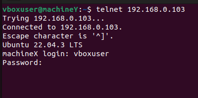
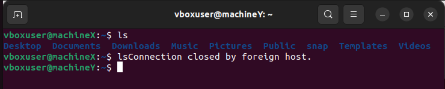
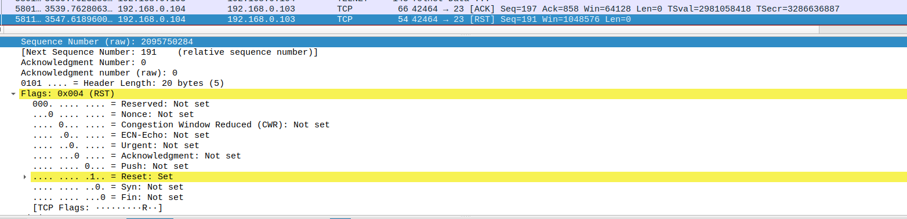

## TCP Reset Attack :

### Group 2:

- Maha Hamdan
- Mounir Khalil
- Bechara Rizk
- Batoul Fakha

### Description of the tool:
#### Attack Tool:

#### Detection Tool:
The detection tool, built with Python and Scapy, is designed to monitor and analyze TCP packets in real-time. By utilizing multi-threading, it ensures efficient packet capture without any losses. The tool's primary goal is to detect suspicious network activities, particularly the TCP reset attack, by examining network traffic and extracting pertinent information from the captured packets.

**Batoul’s Part:**
The packetsniffer() function operates continuously, capturing TCP packets indefinitely without storing them internally using Scapy’s sniff() function. For each packet captured, the packet_extract() function is used to extract essential information, which is then formatted into a dictionary structure.
In the packet extraction process, the tool discerns whether the packet contains IP or IPv6 data. Depending on the type of packet, it extracts relevant fields such as source and destination IP addresses, acknowledgment numbers, sequence numbers, source and destination ports, source and destination MAC addresses, timestamps and flags (with corresponding binary representations indicating packet properties:
-	ACK -> 16 (binary: 010000)
-	PSH -> 8 (binary: 001000)
-	RST -> 4 (binary 000100)
-	SYN -> 2 (binary: 000010)
-	FIN -> 1 (binary:000001)).
  
These details are organized into a dictionary called packet_info.
Each packet_info dictionary is then appended to the shared list sharedData. This packet sniffing and extraction process ensures that the tool captures and compiles essential network data for further analysis.

**Bechara's Part:**
The function detectAttack() uses the data formatted by the packetsniffer() function to detect TCP reset attacks. 
It first checks if the packet is sent to the server and after that for every connection coming to the server we log information about the last packet we received from the client.
If the last packet received from the client has the RST flag set, we check if the new packet has the SYN flag set. If it is the case then it is not an attack.
But in the case the connection tries to continue, then we detected that the attack happened and we log the information about the attack in the file logs.txt.

### How to run the programs:

For the detection tool we need the following libraries:
- scapy (pip install scapy)
- threading (pip install thread6)
After installing the libraries, we can run the python code stored in the directory detectAttack (superuser privileges are required to run the code)
The code will keep running until it is stopped by the user (using ctrl+c)

### Results and Screenshots: 

### Conduct an attack:

We launched two virtual machines X and Y using Oracle virtual Box with the bellow settings 

 

 
 
Using ifconfig command we detected the ip of each machine 
 

##### IP for Machine X is 192.168.0.103

##### IP for Machine Y is 192.168.0.104

 
Then we connected between them using Telnet (an application layer protocol that operates over TCP)

##### Attack Succeeded !!
After running the code of conductAttack the connection disabled and reset attack succeeded !

We can view the reset packet sent using wireshark 

### Detect the attack:
Before the attack is launched, we run the code of detectAttack/main.py to start the detection tool. 

When an attack is launched, the detection tool detects it and logs the attack information in the file logs.txt

We also get a notification in the terminal that an attack has been detected
